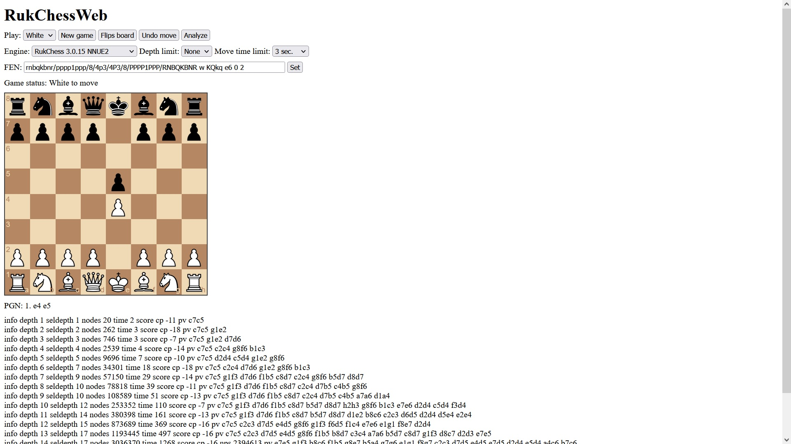

# RukChessWeb
Web interface for usage with the [RukChess](https://github.com/Ilya-Ruk/RukChess) or other engines with support UCI protocol.

# Install
```
git clone https://github.com/Ilya-Ruk/RukChessWeb.git
```
```
cd RukChessWeb
```
```
npm install
```

# Add engine
Copy the executable file with the engine to the "engines" folder. If necessary, also copy the file with the neural network and/or the opening book.

# Config
See [config.php](https://github.com/Ilya-Ruk/RukChess/config.php)

# Print screen



# Resources
1. https://chessboardjs.com/
2. https://github.com/oakmac/chessboardjs/
3. https://github.com/jhlywa/chess.js
